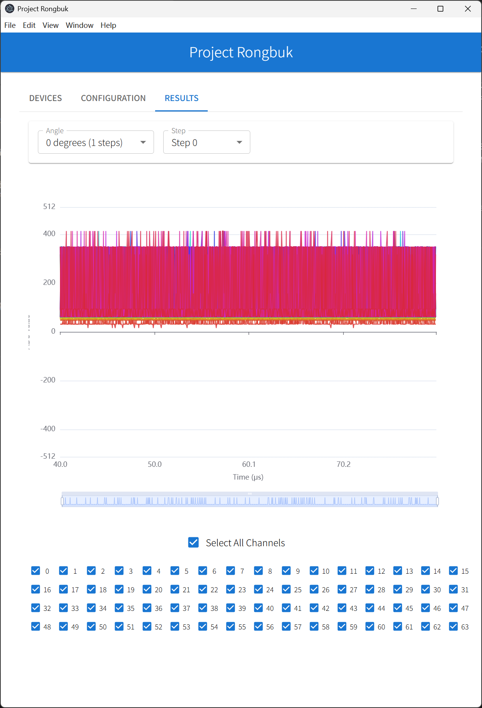

# 功能范围

本软件是 Rongbuk 项目超声信号发射和采集系统的工程工具，用于工程测试 Rongbuk 系统，功能包括：

1. 在局域网中搜索 Rongbuk 设备并建立连接；
2. 通过用户界面操作生成触发超声发射和回波采集的配置，发送给 Rongbuk 设备；
3. 解析收到的数据，绘制信号图形；
4. 保存数据文件；

尚未完成的功能：

1. 保存数据文件；等待确定数据文件格式；
2. 尚未提供 Rongbuk 板载放大器的增益配置，板上有个 DAC 产生电平控制放大器增益，固件尚未支持该功能；

移除或尚未计划支持的功能：

1. 使用串口和 Rongbuk 通讯；该功能在早期版本中提供过，但切换到 tcp 通讯之后，数据格式和程序结构均发生了变化，暂无计划恢复该功能；
2. 目前界面仅支持连接一个设备；可以搜索到多个设备，但如果在已经有连接的情况下点击按钮连接一个新的设备，软件行为未定义；未来可能会在 UI 对此进行限制，即已经连接一个设备时不得同时连接其它设备，必须先断开已有连接；

其它功能说明：

1. 通过网络搜寻设备使用 mDNS-SD 协议，也称为 bonjour 协议，该协议不是百分百可靠，取决于电脑的网络、防火墙、保护软件配置，需修改的网络配置和 TroubleShooting 的办法见 bonjour.md 文档；
2. Rongbuk 接口的数据格式文档属于固件功能和设计范围，参见固件的源码包内的文档说明；

# 使用说明

软件界面较为简单，启动后可以看到 3 个 Tab，Devices, Configuration，Results。

## 1. Devices

选中该 Tab 后，点击 refresh 按钮，如果成功搜到 Rongbuk 设备，可以点击该按钮建立连接。

## 2. Configuration

该 Tab 用于通过界面控件生成触发超声和回波采集的配置。Angles 和 Steps 决定超声触发的模式。

### 角度设置

用户可以通过移动 Angles 滑杆上的两个抓手位置，和右侧下拉框，生成一组扫描角度。

举例如下：

1. 如果两个抓手在同一位置，右侧下拉框只有一个选项（1 Angle），此时仅能扫描一个角度；
2. 如果两个抓手不在同一位置，可以选择扫描多个角度；例如抓手范围是-20° 和 10°，范围是 30°，此时用户可以选择以任何整数等分这 30° 角的角度组合，例如：

- 2 个角度，-20° 和 10°；
- 3 个角度，-20°，-5°，和 10°（间距 15°）；
- 4 个角度，-20°，-10°，0°，和 10°（间距 15°）；
- 依次类推

选择 N Angles 后，所以实际使用的角度会列在表格中（Calculated angles）；

### Steps 设置

Steps 实际上决定了发射的滑动窗口，该设计出现在本项目最初的需求文档中。它的具体含义如下：

用 0-31 标记一共 32 个发射通道：

- 如果 Steps 为 1，则步进只有一次，同时打开所有 32 个通道；
- 如果 Steps 为 2，则步进两次，第一次打开 0-30 号的 31 个通道，第二次打开 1-31 号的 31 个通道；
- 如果 Steps 为 3，则步进三次，第一次打开 0-29 号的 30 个通道，第二次打开 1-30 号的 30 个通道，第三次打开 2-31 号的 30 个通道；
- 依次类推；

所以 Steps 决定了有多少次步进，以及每次步进打开哪些通道发射超声波，但每次打开的通道数量都是一样的，是`(33 - Steps)`个通道，以滑动窗口的方式移动。

在 TX7332 上该滑动窗口对应了 32 通达发射时的使能设置。

### Pattern，Repeat，Tail

这三个参数是 TX7332 合成发射波形时的配置。

界面上的可视化控件可以用于选择每段电平的高低和持续时间。

点击任何一段后可以选择该段使用“高电平”，“地”，“低电平”，通过弹出的 Popup 上滑杆可以设定它的时长，时长的单位是 BF_CLK，即 80MHz 的一个时钟。

该设置和超声换能器的本征频率有关，比如 8MHz 的振动频率，激励波的一个周期就应该是 10，分成 5 个高电平和 5 个低电平，或者相反低电平在前面高电平在后面，都是常规使用方式；但理论上只要周期是 10，其它的配置方式也可以。

Repeat 是上述 Pattern 重复多少次，Tail 是在重复 Pattern 之后加入一个对地的放电。该放电可以保证在收到回波之前把线路上的电荷降低到不影响接受回波的程度，但是受限于 TX7332 内部放电电阻的大小，和线路寄生电容的大小，放电速度并不是很快。如果测量窗口打开的早可以看到放电曲线。

### Window

Windows 选择 Rongbuk 硬件上 STM32 的 DCMI 接口采集数据时的开始和结束时间，相对于 TR_BF_SYNC 的上升沿。该时间和 ADC 无关，Rongbuk 固件在上电之后就启动 ADC 时钟循环输出，即 ADC 的数据线上是一直有合法数据的，Window 仅控制 STM32 采集数据的时间窗口。

### Submit

设置好参数后，用户可以点击 Submit 按钮把配置提交给 Rongbuk 设备开始采集，采集的时间非常快，但目前传输数据较慢，还需要固件优化性能。

## 3. Results

扫描和接受数据结束后可以在界面上预览收到的数据。可以选择角度和步进，每次步进的 64 通道数据，可以选择只显示部分通道。

## 4. 数据存储

之前支持串口的版本会把数据保存在应用程序所在目录下的 data 目录内，未来恢复该功能时也会如此，同时使用关键参数和时间命名文件，该约定和文件格式都还需要具体约定。约定后即可提供功能。
