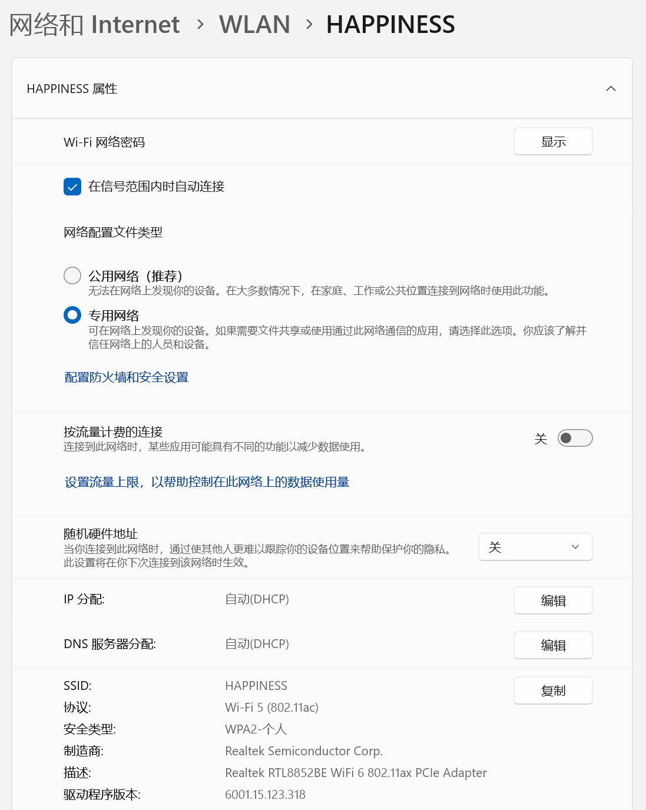

本文档记录无法搜索到 Rongbuk 设备时的解决办法。

# Windows 网络配置

Windows -> 设置 -> 网络和 Internet -> WLAN -> “当前 WiFi 网络”属性，在网络配置文件类型中选择专用网络；



原则上只需要修改该配置即可；但如果用户电脑上有特殊的 Windows 网络防火墙配置，Windows Defender 的特殊配置，其它防护墙或电脑防护软件的特殊配置，则只能一一尝试关闭防护。

# 清理 Windows 的 DNS

在 Windows 搜索框中输入 cmd，在结果中出现“命令提示符”程序，选择“以管理员身份运行”，在出现的命令行界面中依次执行下列命令。

```
netsh winsock reset
netsh int ip reset
ipconfig /release
ipconfig /renew
ipconfig /flushdns
```

# 常见情况

最常见的出现问题的情况发生在网络变更时，比如刚刚更换了 WiFi 网络，从有线网切换到 WiFi，打开关闭了 VPN 或其它 Tunneling 软件，这些是最常见的导致无法搜索到 Rongbuk 设备的原因。

如果确实有网络变化，应首先重新启动 PC 客户端程序；如果仍不能找到 Rongbuk 设备，考虑按照本文档所述检查网络配置，清理 Windows 的 DNS 缓存，以及考虑是否有其它防火墙或电脑保护软件修改了 Windows 网络层发送和接受 IP 数据包的方式（mDNS 仅依赖于特定地址的广播数据包）。

如果所有方式都不能解决问题，建议把 Windows 配置为和 Rongbuk 设备同一 WiFi 网络后，确定网络配置文件类型确实是“专用网络”，不是“公用网络”，然后重启电脑，重新打开软件。

mDNS 问题不是一定能良好解决的，有时候即使理论上能解决，对用户来说，使用体验上也非常困难甚至不可行。建议产品设计上考虑在 Rongbuk 设备上显示 IP 地址的可能。
